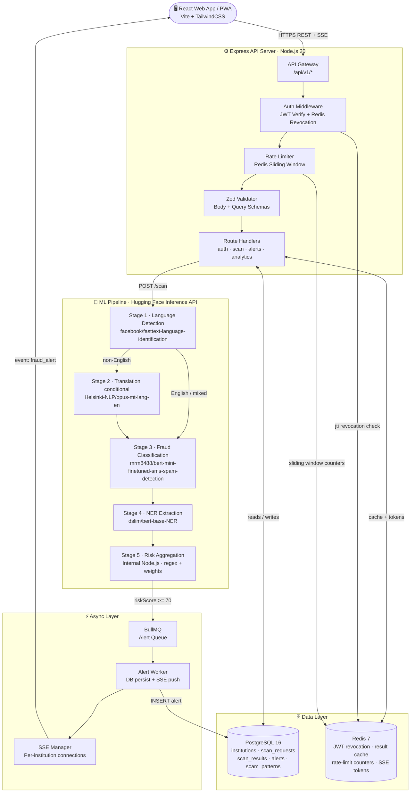
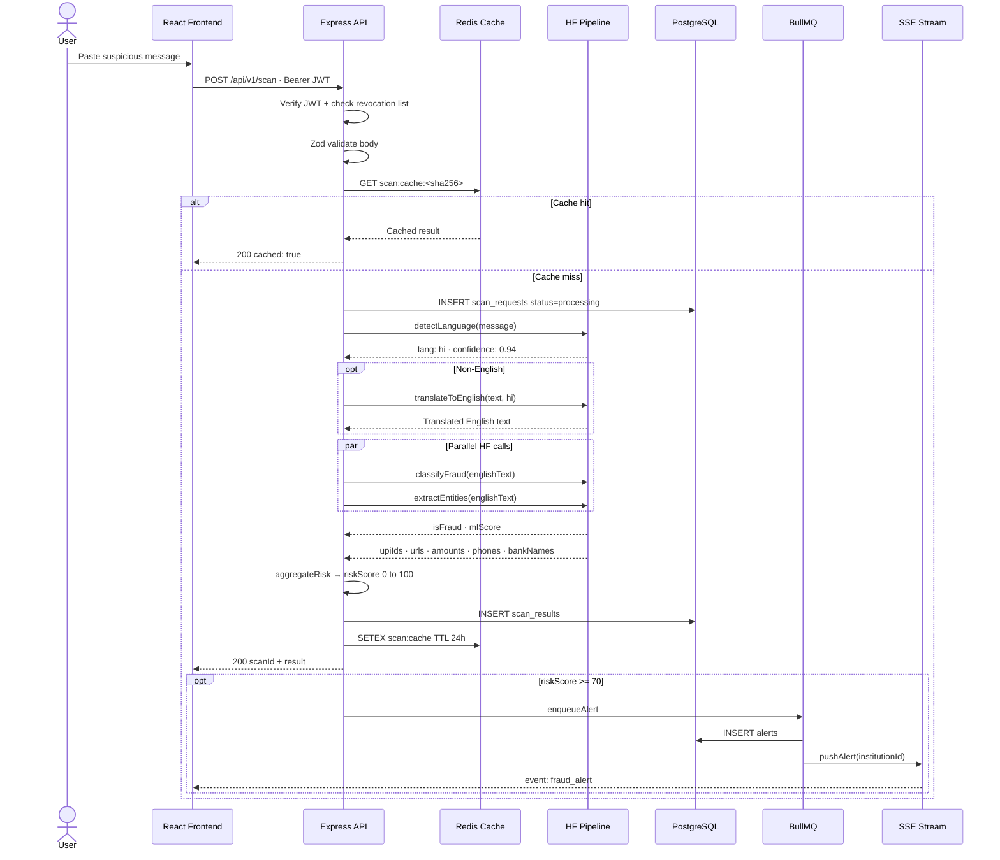
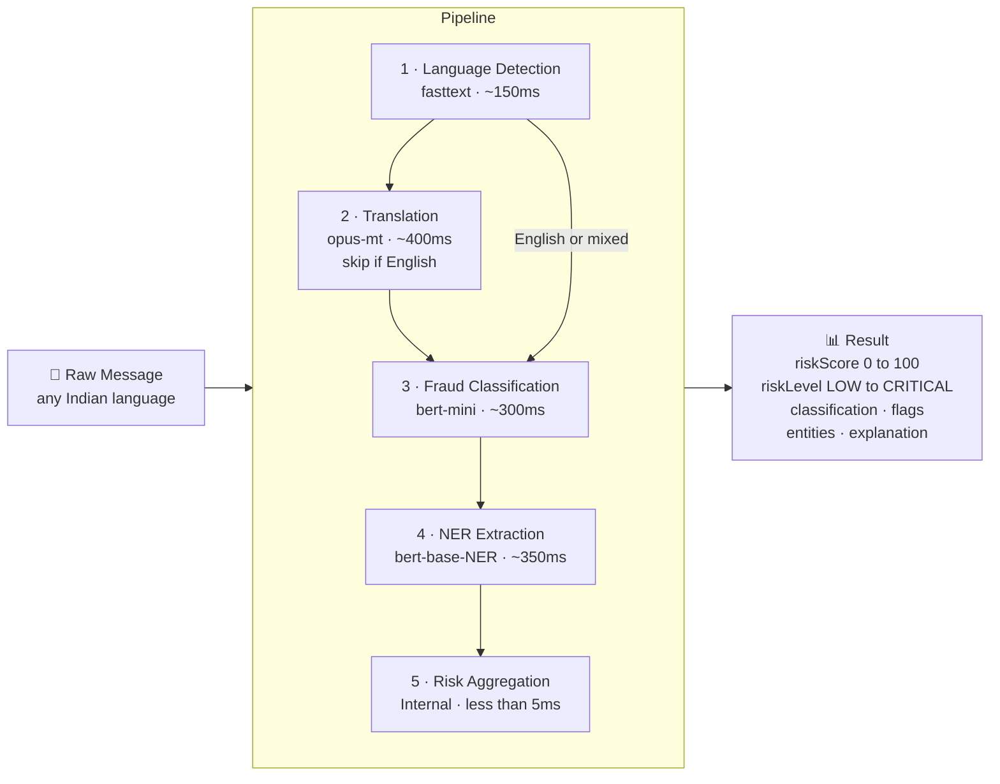
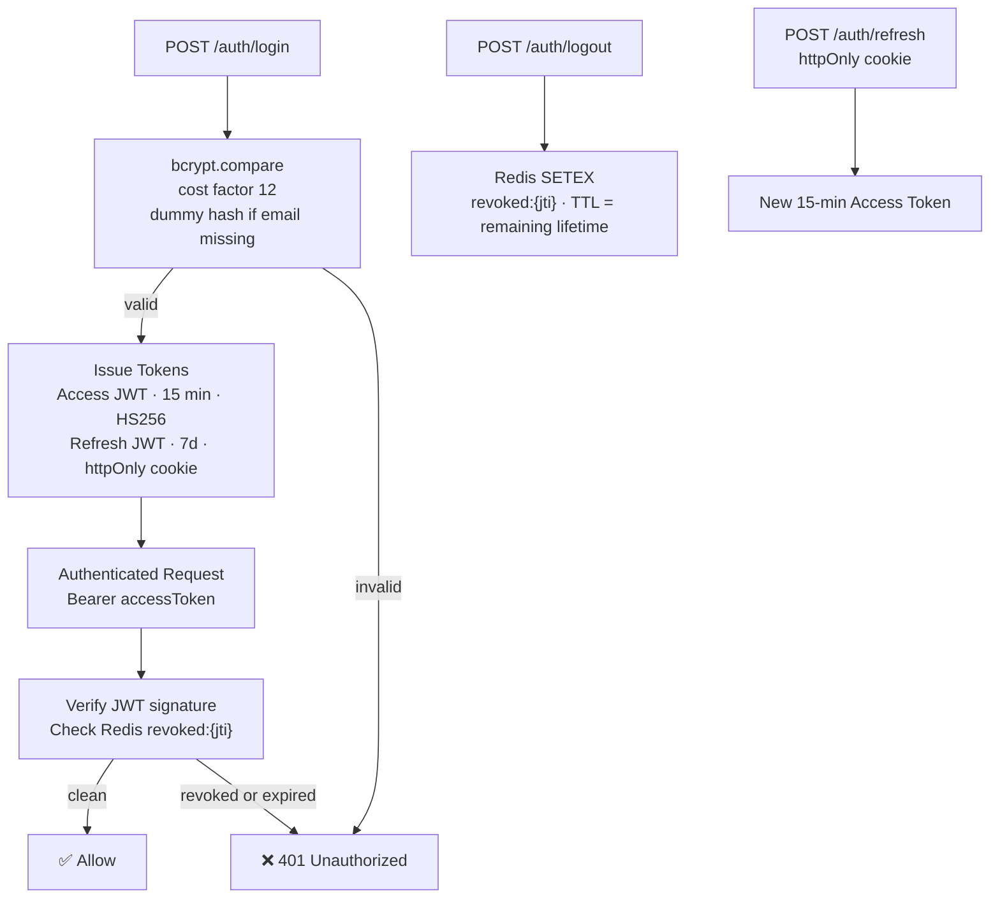
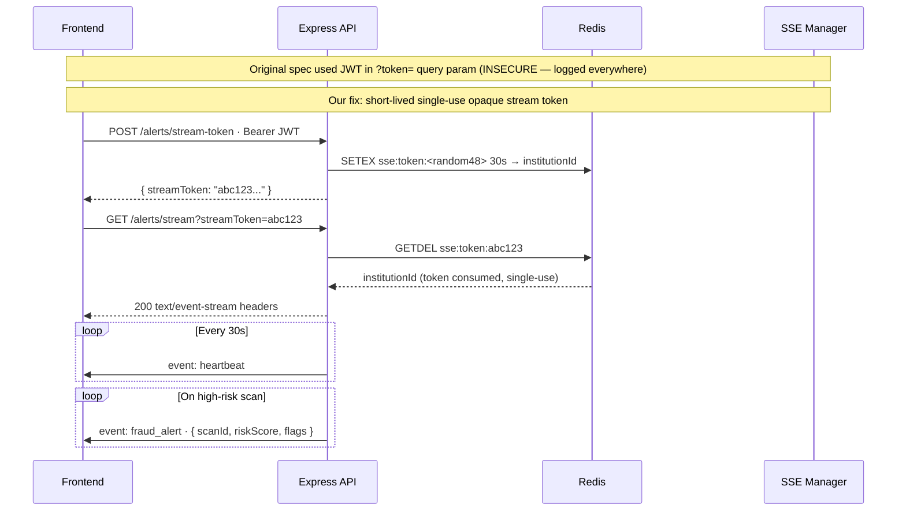
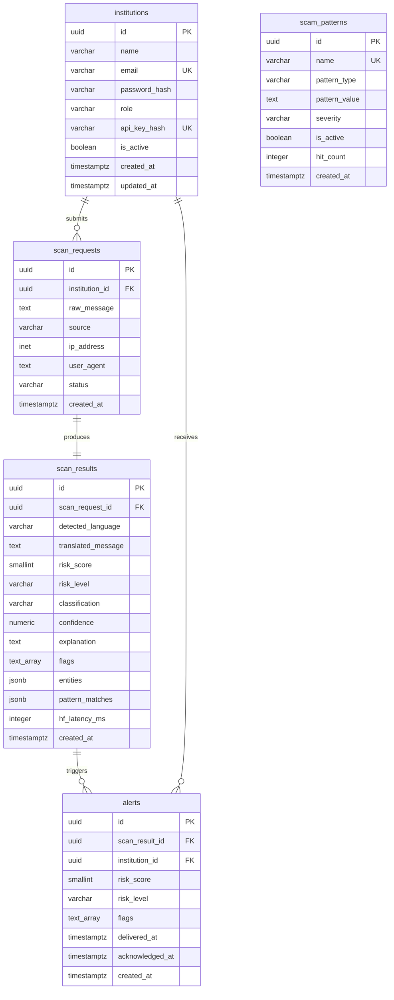

# 🛡️ UPI Fraud Guard

> Real-time multilingual SMS & UPI fraud detection platform built for India's digital payments ecosystem.

[](https://nodejs.org)
[](https://expressjs.com)
[](https://postgresql.org)
[](https://redis.io)
[](https://huggingface.co)

---

## Overview

UPI Fraud Guard accepts raw SMS or UPI message text in **any Indian language or Hinglish**, runs it through a multi-stage AI pipeline powered by the Hugging Face Inference API, and returns a **risk score, extracted entities, and a plain-language explanation** — all in under 2 seconds.

Designed for banks, payment aggregators, and fintech institutions to monitor and flag fraudulent communication at scale.

---

## System Architecture



---

## Request Data Flow



---

## ML Pipeline Detail



**Risk Score Formula:**
```
riskScore = (mlScore × 100 × 0.6) + (patternScore × 0.3) + (entityRisk × 0.1)
```

| Score | Level | Classification |
|---|---|---|
| 0 – 34 | LOW | LEGITIMATE |
| 35 – 59 | MEDIUM | SUSPICIOUS |
| 60 – 79 | HIGH | FRAUDULENT |
| 80 – 100 | CRITICAL | FRAUDULENT |

---

## Auth & Token Flow



---

## SSE Secure Stream Flow



---

## Database Schema



---

## Redis Key Schema

| Key Pattern | Type | TTL | Purpose |
|---|---|---|---|
| `scan:cache:<sha256>` | String JSON | 24h | Identical message result cache |
| `revoked:<jti>` | String | Token remaining TTL | JWT logout revocation list |
| `rl:pub:<ip>` | Sorted Set | 1 min | Public endpoint rate limit |
| `rl:auth:<id>` | Sorted Set | 1 min | Authenticated endpoint rate limit |
| `rl:login:<ip>` | Sorted Set | 15 min | Login brute-force guard |
| `sse:token:<token>` | String | 30s | Single-use SSE stream token |
| `hf:status` | String JSON | 30s | HF API last health result |

---

## Security Architecture

| Threat | Mitigation |
|---|---|
| Weak JWT secret | Zod env validation enforces ≥ 64 chars — process exits if missing |
| Long-lived tokens | 15-min access JWTs + httpOnly 7-day refresh cookie |
| No logout revocation | Redis jti blocklist, TTL = token remaining lifetime |
| JWT in SSE URL log exposure | Short-lived 30s single-use opaque stream token |
| Brute-force login | 10 attempts / 15 min per IP on `/auth/*` endpoints |
| API key plaintext storage | HMAC-SHA256 hashed in DB, shown once on creation |
| Timing attack on login | Dummy bcrypt compare when email not found |
| SQL injection | Parameterised `pg` queries only — zero string interpolation |
| Payload DoS | 50KB JSON body cap, 512-char HF input cap |
| Verbose error leakage | Stack traces stripped in all production responses |
| Server fingerprinting | `X-Powered-By` removed, Helmet security headers applied |
| CORS misconfig | Explicit origin whitelist from `CORS_ORIGIN` env var |
| Container privilege escalation | Non-root `appuser` in Dockerfile |

---

## Technology Stack

| Category | Choice | Rationale |
|---|---|---|
| Runtime | Node.js 20 LTS | Non-blocking I/O ideal for concurrent HF API calls |
| Framework | Express 5 | Minimal, stable, hackathon-friendly |
| Database | PostgreSQL 16 | Relational integrity + JSONB for entity storage |
| Cache / Queue | Redis 7 + BullMQ | Fast cache, reliable job queue, rate limiting store |
| ML Inference | Hugging Face Inference API | Zero infra, 3 public models, free-tier viable |
| Auth | JWT HS256 + bcrypt | Stateless access tokens, secure password hashing |
| Validation | Zod | Runtime type safety on all inputs and env vars |
| Real-time | Server-Sent Events | One-directional push, simpler than WebSockets |
| Logging | Winston | Structured JSON logs, redacts sensitive fields |
| Container | Docker + Compose | One-command local dev stack |

---

## Project Structure

```
upiguard-backend/
├── src/
│   ├── app.js                     # Express app, security middleware stack
│   ├── server.js                  # HTTP server + graceful shutdown
│   ├── config/
│   │   ├── env.js                 # Zod env validation — exits on error
│   │   └── database.js            # pg Pool singleton
│   ├── middleware/
│   │   ├── auth.js                # JWT verify, issue, revoke
│   │   ├── rateLimiter.js         # Redis sliding-window limiters
│   │   ├── validate.js            # Zod validation factory
│   │   └── errorHandler.js        # Global error handler, no stack in prod
│   ├── routes/
│   │   ├── auth.routes.js
│   │   ├── scan.routes.js
│   │   ├── alerts.routes.js
│   │   ├── analytics.routes.js
│   │   └── health.routes.js
│   ├── controllers/
│   │   ├── auth.controller.js     # register · login · refresh · logout
│   │   ├── scan.controller.js     # submit · history · detail
│   │   ├── alerts.controller.js   # stream-token · SSE · list · acknowledge
│   │   ├── analytics.controller.js
│   │   └── health.controller.js
│   ├── services/
│   │   ├── mlPipeline.js          # 5-stage HF pipeline + exponential backoff
│   │   ├── redisClient.js         # ioredis singleton
│   │   ├── sseManager.js          # SSE connection registry + stream tokens
│   │   └── alertWorker.js         # BullMQ worker
│   ├── schemas/
│   │   ├── auth.schema.js
│   │   └── scan.schema.js
│   └── utils/
│       ├── logger.js              # Winston structured logger
│       ├── apiError.js            # Typed API error class
│       └── crypto.js              # API key gen/hash, message hash, safeEqual
├── migrations/
│   ├── 001_init.sql               # Full schema with constraints + indexes
│   └── run.js                     # Migration runner script
├── .env.example
├── .gitignore
├── Dockerfile
├── docker-compose.yml
└── README.md
```

---

## Quick Start

```bash
# 1. Install
npm install

# 2. Configure
cp .env.example .env

# 3. Generate secrets
openssl rand -hex 64   # → JWT_SECRET
openssl rand -hex 32   # → API_KEY_SALT

# 4. Get a HuggingFace token
# huggingface.co/settings/tokens → New token (Read) → copy hf_xxx → HF_API_TOKEN

# 5. Run everything
docker compose up --build
```

Manual (no Docker API server):
```bash
docker compose up postgres redis -d
npm run migrate
npm run dev
```

---

## API Reference

| Method | Path | Auth | Description |
|---|---|---|---|
| POST | `/api/v1/auth/register` | Public | Register institution account |
| POST | `/api/v1/auth/login` | Public | Login → access token + refresh cookie |
| POST | `/api/v1/auth/refresh` | Cookie | Issue new access token |
| POST | `/api/v1/auth/logout` | Bearer | Revoke current access token |
| POST | `/api/v1/scan` | Bearer | Submit message for fraud analysis |
| GET | `/api/v1/scans` | Bearer | Paginated scan history |
| GET | `/api/v1/scans/:id` | Bearer | Single scan full detail |
| GET | `/api/v1/analytics/summary` | Bearer | 30-day dashboard stats |
| POST | `/api/v1/alerts/stream-token` | Bearer | Issue SSE stream token |
| GET | `/api/v1/alerts/stream?streamToken=` | Token | Real-time SSE alert stream |
| GET | `/api/v1/alerts` | Bearer | Alert history |
| PATCH | `/api/v1/alerts/:id/acknowledge` | Bearer | Acknowledge an alert |
| GET | `/api/v1/health` | Public | Liveness check |
| GET | `/api/v1/health/deep` | Admin | Full dependency health check |

---

## Environment Variables

| Variable | Required | Description |
|---|---|---|
| `DATABASE_URL` | ✅ | PostgreSQL connection string |
| `REDIS_URL` | ✅ | Redis connection string |
| `JWT_SECRET` | ✅ | Min 64 chars — `openssl rand -hex 64` |
| `API_KEY_SALT` | ✅ | Min 32 chars — `openssl rand -hex 32` |
| `HF_API_TOKEN` | ✅ | Hugging Face token starting with `hf_` |
| `CORS_ORIGIN` | ✅ | Frontend origin e.g. `http://localhost:5173` |
| `NODE_ENV` | — | `development` / `production` (default: development) |
| `PORT` | — | API port (default: 3001) |
| `BCRYPT_ROUNDS` | — | bcrypt cost factor 10–14 (default: 12) |
| `JWT_ACCESS_EXPIRES_IN` | — | Access token TTL (default: `15m`) |
| `JWT_REFRESH_EXPIRES_IN` | — | Refresh token TTL (default: `7d`) |
| `HF_TIMEOUT_MS` | — | Per-request HF timeout ms (default: 5000) |
| `HF_RETRY_ATTEMPTS` | — | Max HF retries with backoff (default: 1) |
| `SSE_STREAM_TOKEN_TTL_S` | — | Stream token lifetime seconds (default: 30) |
